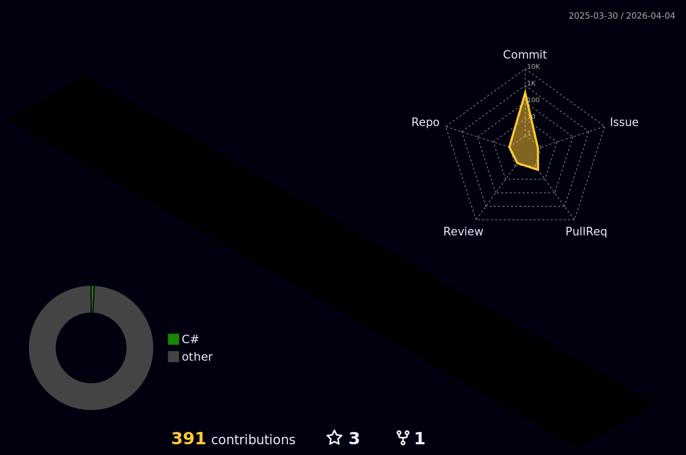

## Hi there 👋

<h2 align="center"> 📝 Profile 📝 </h2>

😊 Name : Kim Geunah(김근아)  
                📩 Email : rmsdk617@naver.com  
                📋 Activity : 부경대학교 윈도우 플랫폼기반 IoT 시스템개발자 과정(2024.01 ~ 2024.09)  
                Project : ...  
                Major :  
                Minor : 

<h2 align="center"> 📚 Tech Stack 📚 </h2>
<h4>✨ Front-end ✨</h4>
    
    
    

<h4>✨ back-end ✨</h4>
    
    
    
    
    

 

<!-- <h2 align="center"> 기술 명세 </h2>

| 기술분류 | 명세 |
| :---: | :---: |
| VSCode |  |
| Python |  |
|  |  | -->

<h2 align="center"> 🛠️ Using Tools ️🛠️ </h2>

    <!-- 
    
     -->
    
    
    
    
    
    
    

 

<h2 align="center"> 🌟 Stats 🌟 </h2>

    <a href="https://github.com/HyungJuu">
        
        

<!--  -->

<!--  -->

 

